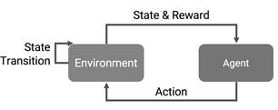
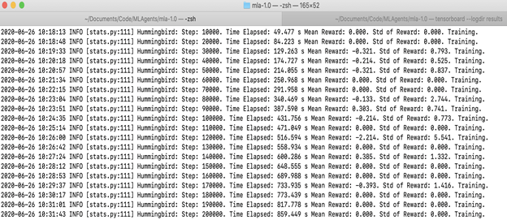
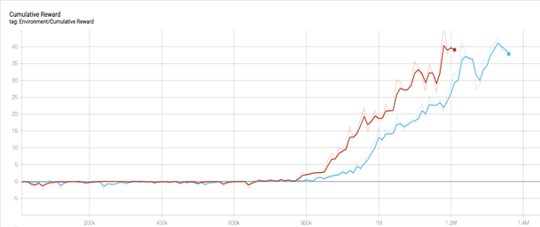
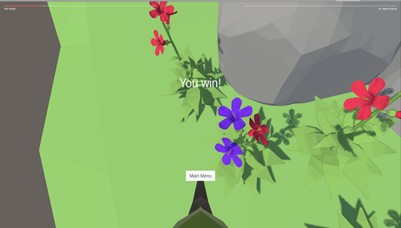
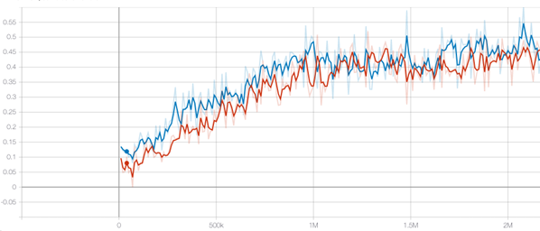
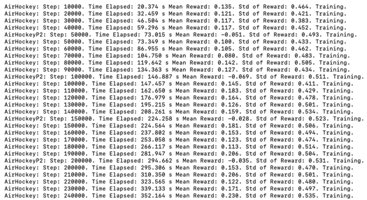

# Play Air Hockey with Unity's ML-Agents, Reinforcement Learning

**1. Summary**
--------------

In the project, I started off by doing a -[Hummingbird tutorial](https://learn.unity.com/course/ml-agents-hummingbirds) from
Unity-Learn to get an idea about ML-Agents, reinforcement learning, and
training a model. Simultaneously, I explored the Unity Editor and tried
out building the entire scene. While training the bird's model, I
understood a lot about hyperparameters which I then tweaked and tuned to
try out new models, the trial and testing sometimes gave me horrible
results making me realize how much a change in a parameter could affect
the performance of a model.

Once I was through the tutorial and had a basic understanding of how
ML-Agents work, I decided to build another game and empower it with
ML-Agents. I chose **Air Hockey** where I wrote my own observations and
change the config file to train the model in such a way that it performs
best. It didn\'t work out great at the beginning, then I added more
observations, rewards, made some code changes, and provided a scoring UI
to finally create an amazing ML-Agent that was smart enough to never let
me win!!

**2. Getting Started**
----------------------

You can create a new project, or you can use the existing project to
empower your game components with ML-Agents.

**2.1 Installation**
1.  Go to the package manager and install the 'Ml Agents' to your Unity
    Project.
2.  Install python or conda (to manage different python versions)
    -[python](https://www.python.org/downloads/),
    [conda](https://docs.conda.io/projects/conda/en/latest/user-guide/install/)
3.  If using conda, create the conda environment with the following
    command in the terminal\
    conda create -n \<environment name\> python=\<python version\>
4.  If using conda, to list the existing environment\
    conda env list
5.  If using conda, activate the created environment\
    conda activate \<environment name\>
6.  Install python's ML Agent module\
    pip install mlagents

**2.2 Training**

To get started with the training, refer to this detailed official Unity
documentation which can be found at [Unity
ml-agents](https://github.com/Unity-Technologies/ml-agents/tree/master/docs).

**2.3 Workflow**

The workflow of ML-Agents has 3 main components:

-   Agent - The agents will be our main players, characters, or
    something that will be performing a task by taking various actions.
    The agent actions will be driven by the machine learning algorithm
    and not any input from the user.

-   Brain - Brains are the actual core component that perceives the
    environment and decides the actions that should be performed by the
    agents. One brain can control one or more agents. There can be
    multiple brains controlling multiple agents in an environment.
    Usually, similar agents would have a single brain controlling them
    whereas vastly different agents would be controlled by different
    brains.

-   Academy - An academy object has all the brains in the environment as
    its child objects. There will only be a single academy per
    environment. An academy is used for configuration and settings like
    rendering quality or the timescale, resolution of the game.

And finally, the system uses a Python API to externally communicate with
Tensorflow.

**2.4 Reinforcement Learning**

We are using 'Reinforcement Learning' to train the ML Agent where for
every action the agent performs, there will be a certain reward
associated with it which could be either positive or negative so that
the ML-Agent trains in the right direction.

**Fig 1 - Reinforcement learning**

Typically if the action taken allows the agent to move closer to the
goal or closer to completing a task, the agent will be positively
rewarded and likewise, if the action taken is far off from task
completion, then the agent is penalized. This reward system is called a
reward function.

**3. Projects**
---------------

### **3.1 Hummingbird**

The idea behind the hummingbird project was to create intelligent flying
hummingbirds that can navigate to flowers, dip their beaks in and drink
nectar from the flower. While drinking nectar from the flower, initially
the color of the flower is red and later turns to purple after the
nectar has been consumed by the bird. We learned to craft a training
environment, train the neural model in such a way that the birds learn
to fly only towards the flowers, and drink the nectar from them. Towards
the end, we created a mini game where we challenged the trained humming
bird to play with us!

#### 3.1-1 Training 

The training of our agent, i.e the hummingbird involved creating an
environment and creating duplicates of it for it to train faster and
give better results sooner.

The picture below shows the reward awarded to the bird while training:

**Fig 2 - Humming Bird's training results**

Initially, as you can see the hummingbird seems to be wandering around
in the scene and therefore has received 0 reward. However, as the bird
moves out of the boundary set in the environment or is around the tree
(which is far from the flowers) it gets a negative reward. Slowly, as
the bird comes closer to the flower, it begins to get positive reward
and soon after multiple iterations, the bird learns to stay closer to
the flowers and then gets the nectar from them.

**Fig 3 - Humming Bird's training results, Graphs showing the
performance of 2 best-trained models, X-Axis represents the number of
iterations, Y-Axis represents mean reward the humming bird earns**

#### 3.1-2 Implementation 

Finally, after training a couple of models we noticed that the humming
bird has learnt to drink nectar from the flower.

#### Initially, to test out the trained model, we played a match against the ML trained bird and the result was as follows: 

First trained model: The bird wasn't able to compete at all.

**Fig 4 - First trained model results**

Second trained model: The bird has learned and was able to drink nectar
from the flower but we definitely were better.

**Fig 5 - Second trained model results**

### **3.2 Air Hockey**

The goal was to apply the knowledge gained from the hummingbird tutorial
to our own Air Hockey project. In this, we developed a game of Air
Hockey which follows the old traditional rules as anyone would expect.
We trained the air-hockey paddles by providing a set configuration so
that it learns to score as well defend based on the opponent's moves. In
the end, we created a mini game where we challenged the trained ML Agent
to play with us!

#### 3.2-1 Training 

We started out by first training our player with just 5 observations for
the air-hockey paddle, and then we later improved our observations
making the observation count to 17 which got us the best possible
results.

The Player observes these observations frame by frame as the game
progresses. The 17 observations include:

1.  Three 2d-vectors

    a.  From Player's air-hockey paddle to the puck

    b.  From First Player's air-hockey paddle to goal

    c.  From second Player's air-hockey paddle to goal

2.  Five positions in a 2D plane

    a.  Player's air-hockey paddle

    b.  Opponents air-hockey paddle

    c.  Opponents goal

    d.  Player's own goal

    e.  Puck's position

3.  One distance magnitude

    a.  Player's air-hockey paddle to the puck

**Fig 6 - Training the Air Hockey model**

Based on these observations and the set configuration for the
hyperparameters we trained our model and the following trend is
observed.

**Fig 7 - Air Hockey training results, the graph represents the mean
reward of the Player's air-hockey paddle in the y-axis and the number of
iterations on the x-axis. The blue curve is for the first player and
orange is for the second.**

**Fig 8 - Air Hockey training results**

It is clearly visible from the trend that initially our model's mean
reward wasn't very good and the player's paddle was just moving randomly
and were not able to score.

[Intitial\_training\_video](media/training_videos/inital_training.mp4)

But over the course of training and with the increase in the number of
iterations our model learned to perform well. Players became more
aggressive and started scoring more with each iteration. They started
observing pucks position and based on the opponent's paddle position
they learned to defend their side too. A similar trend can also be seen
in the training video.

[Training\_over\_time](media/training_videos/after_hours_of_training.mp4)

#### 3.2-2 Implementation 

After 2 days of training and lots of hyperparameter tweening, when our
trained player started performing reasonably well, we decided to compete
against it. We created a separate UI for the game and added a timer and
a scoring mechanism to keep track of who's winning.

**Fig 9 - Ash vs ML-Agent**

Watch the nail-biting match against the superbly trained ML-Agent vs me here and to see who finally won! -
[AirHockeyDemo.mp4](media/training_videos/trained_model_vs_human.mp4)
